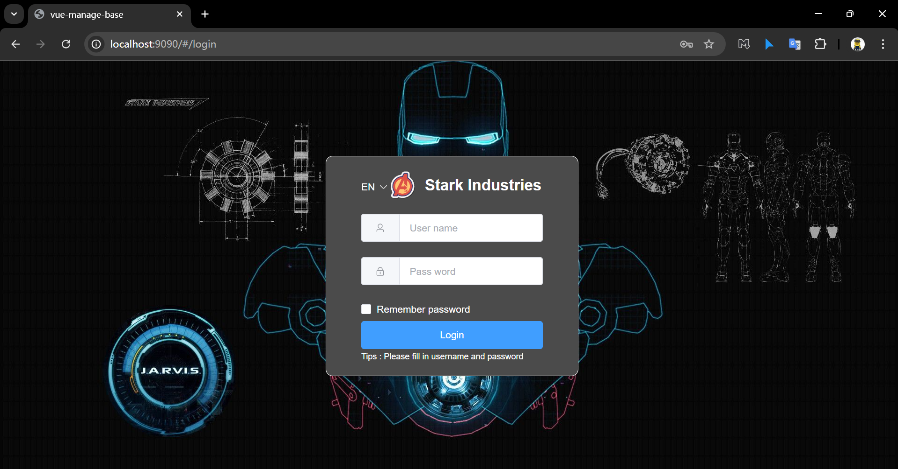
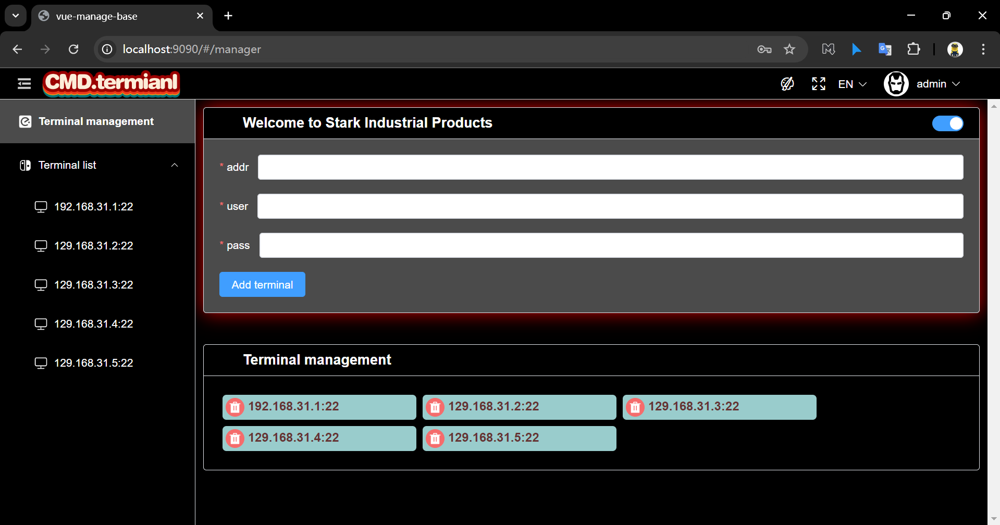
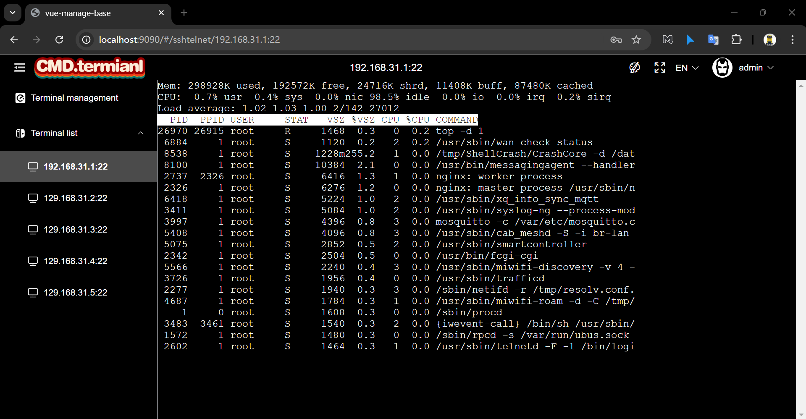
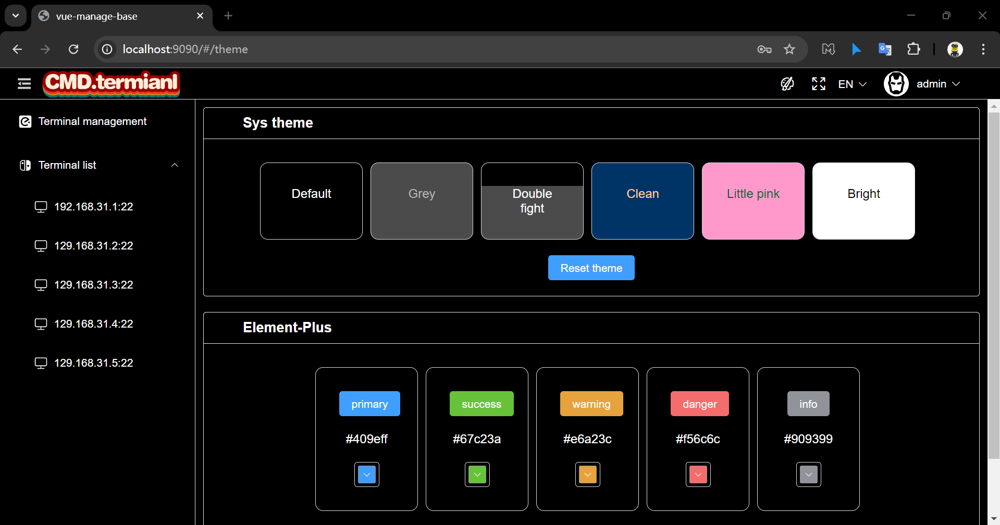
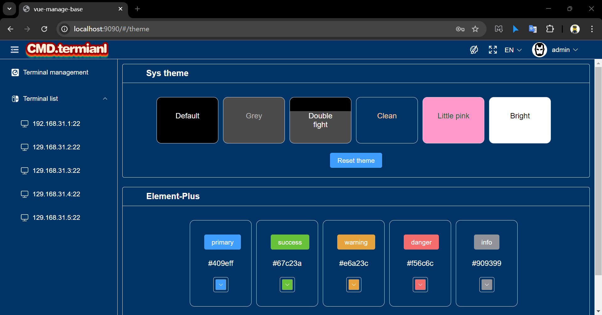
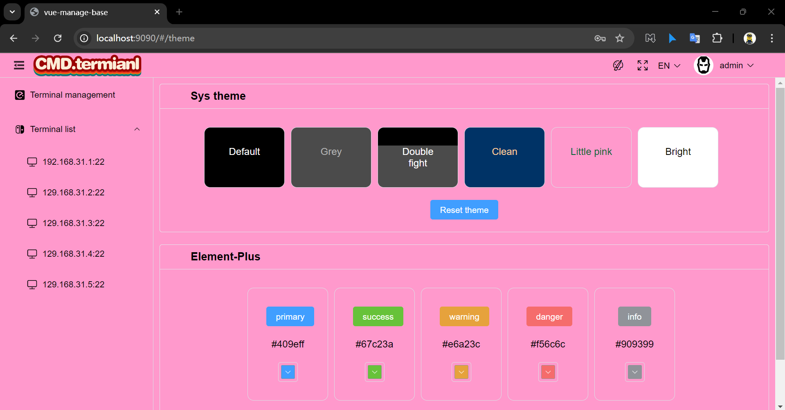

#     Componentsbrz</img>

# Componentsbrz Background

I call it the component experimental field, which contains some interesting example and springboot component, which will continue to be added later.

The following introduces the naming rules and content overview. And make it easier for you to view this project.

- __Naming rules:__ 
  - Directories ending in "brz" are springboot components. brz comes from "Subaru BRZ" which is a great car. And i like the letter ending "brz". 
  - Directories that do not end with "brz" are examples of using these components. These examples are more interesting. 

- __Compile:__ 
  - Useing jdk 17 or above version.
  - Useing node 22.4.0.
  - run "mvn install" in the root directory "componentsbrz".

# Below is an introduction to all components

- __websocketbrz__ 
  - [Component Description](./websocketbrz/README.md)
  - Example1:terminalhub 
  An example of remote SSH login developed using the websocketbrz component.
  

    
    
  

  

    
    
  

  

    
    
  

  

    
  

  
  - Example2:chatroom 
  An example of a chat room developed using the websocketbrz component. 
  First, run the jar file as the chat registration center: java -jar chatroom-1.0.0-SNAPSHOT.jar 
  Then open "wbclient.html" with a browser.

- __flowcontrolbrz__ 
  - [Component Description](./flowcontrolbrz/README.md)
  - Example1: not yet 

- __messagebrz__ 
  - [Component Description](./messagebrz/README.md)
  - Example1: not yet 
  
